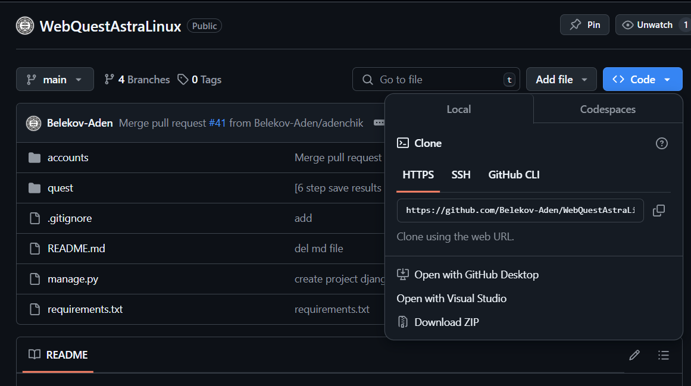

# AstraLinux Quest

## Описание проекта

AstraLinux Quest — это веб-приложение в формате интерактивного квеста, предназначенного для изучения операционной
системы Astra Linux. Пользователи проходят различные задания, связанные с основами работы в системе, командной строкой,
настройкой параметров и администрированием. Прохождение задании из 7 этапов!

## Функционал

- Вход и регистрация пользователей
- Интерактивные задания с проверкой ответов
- Подсказки и справочная информация
- Подведение итогов и отображение прогресса

## Технологии

- **Backend**: Django, Python, JS
- **Frontend**: HTML & CSS,
- **База данных**: SQLite3
- **Дополнительно**:

## Установка и запуск

## Авторы

- Белеков Аден / Backend разработчик
- Герасимов Никита / Backend разработчик
- Фомин Герман / Дизайнер

## Запуск локально

### Требование к запуску

* Необходимо что бы был установлен Python 3.10+
* Наличие интернета (т.к некоторые ресурсы берутся от туда)

### Установка [Windows]

С этого репозитория скачать архивом файл > Download ZIP

После извлечь из архива в папку -> и запустить файл `run.bat`
И ожидать сообщение 'Запуск веб-приложение ...'

## Лицензия

Этот проект распространяется под лицензией MIT. Подробнее см. в файле LICENSE.

